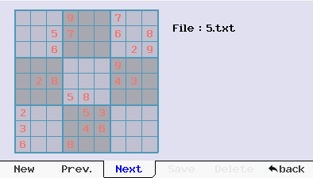
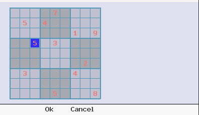
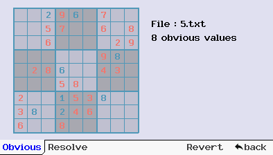
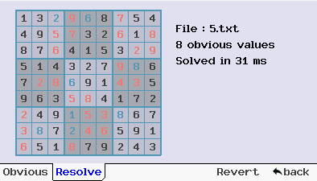

# *sudoSolver*

### Présentation

`sudoSolver` est un *addin* pour Graph 90+E ecrit en C++ pour créer, éditer des grilles de Sudoku puis leur trouver une solution.

L'application est organisée autour d'une barre de menu horizontale; la navigation s'effectuant en appuyant sur les touches de contrôle situées "sous" les items.
* *File* permet d'accéder au sous-menu de gestion des fichiers
* *Edit* permet de modifier une grille
* *Solve* donne accès aufonction de recherche des solutions
* *Quit* sort de l'application

### Informations de version

| Dépôt &nbsp;| https://gitea.planet-casio.com/Jhb/sudoSolv |
|----- |-------------------------------------|
| **Date** | 17 janvier 2024 |
| **Version stable** | **0\.1.18** - branche `master` |

### Gestion des fichiers
Le menu *File* permet de gérer les grilles de sodoku : création d'une nouvelle grillen navigation dans le dossier, sauvegarde, suppression.

Les grilles sont toutes enregistrées et chargées à partir du dossier `fls0\grids`. Si le dossier n'existe pas, il sera crée au lancement de l'application.

Le sous-dossier `grids` dans le dépôts propose quelques grilles.

Dans ce dossier, chaque grille est enregistrée dans un fichier au format texte dont le nom est automatiquement incrémenté.

Le menu propose les options suivantes:
* *New* : Création d'une nouvelle grille
* *Prev* : Chargement du fichier précédent dans le dossier
* *Next* : Ouverture du fichier suivant
* *Save* : Sauvegarde du fichier modifié
* *Delete* : Suppression du fichier courant
* *back* : retour un menu principal

### Modification d'un grille
Le menu *Edit* permet de modifier une grille existante ou de générer une nouvelle grille à partir d'une matrice vierge.

Les touches 
Il suffit d'appueyer sur une touche pour mettre la valeur à la position cournate; si cela est possible en l'étât.

### Résolution
Enfin le menu *Solve* donne accès aux fonctions de recherche des valeurs évidentes (obvious values) ou d'une solution complête.

*Obvious* recherche les valeurs évidentes pour la grille. Il s'agit des valeurs que l'on peut mettre sans effectuer aucune hypothèse.

Ces valeurs sont affichées en bleu dans la grille.

La résolution est bien plus rapide lorsque l'on a recherché les valeurs évidentes au préalable.

*Resolve* recherche une solution pour la grille courante.

*Revert* retire les éléments trouvés et retourne à la grille d'origine.

*back* permet de revenir au menu principal.