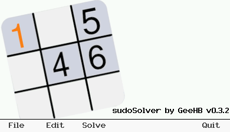

# *sudoSolver*

### Présentation

`sudoSolver` est un *addin* pour Graph 90+E ecrit en C++ pour créer, éditer des grilles de Sudoku puis leur trouver une solution.

L'application est organisée autour d'une barre de menu horizontale; la navigation s'effectuant en appuyant sur les touches de contrôle situées "sous" les items.
* *File* permet d'accéder au sous-menu de gestion des fichiers
* *Edit* permet de modifier une grille
* *Solve* donne accès aux fonctions de recherche automatisée des solutions et permet aussi à l'utilisateur de chercher par lui même une solution.
* *Quit* sort de l'application

### Informations de version

| Dépôt &nbsp;| https://gitea.planet-casio.com/Jhb/sudoSolv |
|----- |-------------------------------------|
| **Date** | 9 février 2024 |
| **Version stable** | **0\.3.2** - branche `master` |

### Gestion des fichiers
Le menu *File* permet de gérer les grilles de sodoku : création d'une nouvelle grille, navigation dans le dossier, sauvegarde, suppression.

Les grilles sont toutes enregistrées et chargées à partir du dossier `fls0\grids`. Si le dossier n'existe pas, il sera crée au lancement de l'application.

Le sous-dossier `grids` dans le dépôt propose quelques grilles.

Dans ce dossier, chaque grille est enregistrée dans un fichier au format texte dont le nom est automatiquement incrémenté.

Le menu propose les options suivantes:
* *New* : Création d'une nouvelle grille
* *Prev* : Chargement du fichier précédent dans le dossier
* *Next* : Ouverture du fichier suivant
* *Save* : Sauvegarde du fichier modifié
* *Delete* : Suppression du fichier courant
* *back* : retour un menu principal

### Modification d'une grille
Le menu *Edit* permet de modifier une grille existante ou de générer une nouvelle grille à partir d'une matrice vierge.

Les touches de navigation déplacent le curseur dans la grille.
Et il suffit d'appuyer sur une des touches comprises entre '1' et '9' pour mettre la valeur associée à la position courante; si cela est possible en l'étât.
La touche '0' supprime la valeur en place.

### Résolution
Le menu *Solve* permet, au choix, de rechercher par soi même une solution ou de demander au programme d'en trouver une. 

#### Résolution manuelle
L'item *Manual* permet à l'utilisateur de chercher une solution par lui même. Dans ce cas les éléments "posés" sur la grille sont ajoutés avec la couleur noire.
Le système offre néanmoins la possiblité de poser des hypothèses. Cela passe par le choix d'une couleur. Dès lors qu'une couleur est choisie, tous les éléments liés sont affichés avec une pastille colorée. Cela permet d'un coup d'oeil de voir tous les éléments liés à une hypothèse. 
La couleur utilisée est aussi reprise dans l'affichage du menu.

Par exemple, avec le choix de la couleur verte :

Le sous-menu offre les possiblités suivantes :
* *Col.* : Choix d'une hypothèse, marquée par une couleur. 
En choisissant cette option, un sous menu-menu est affiché (encore un ...) permettant de choisir une couleur en cochant la case associée. Lorsque toutes les cases sont décochées (position par défaut), aucune hypothèse n'est en place.

* *Accept* : Tous les éléments d'une hypothèse (ie. tous les éléments marqués par la couleur) sont intégrés à la grille et donc se voient retirer leur couleur,

* 'Reject' : Tous les éléments d'une hypothèse sont rejetés. Ces éléments sont donc retirés de la grille.

* *End* permet de sortir du mode résolution manuelle et de retourner au msous-menu *Solve*.

#### Résolution automatique

*Obvious* recherche les valeurs évidentes pour la grille. Il s'agit des valeurs que l'on peut mettre sans effectuer aucune hypothèse.

Ces valeurs sont affichées en bleu dans la grille.

La résolution est bien plus rapide lorsque l'on a recherché les valeurs évidentes au préalable.

*Resolve* recherche une solution pour la grille courante.

*Revert* retire les éléments trouvés et retourne à la grille d'origine.

*back* permet de revenir au menu principal.
